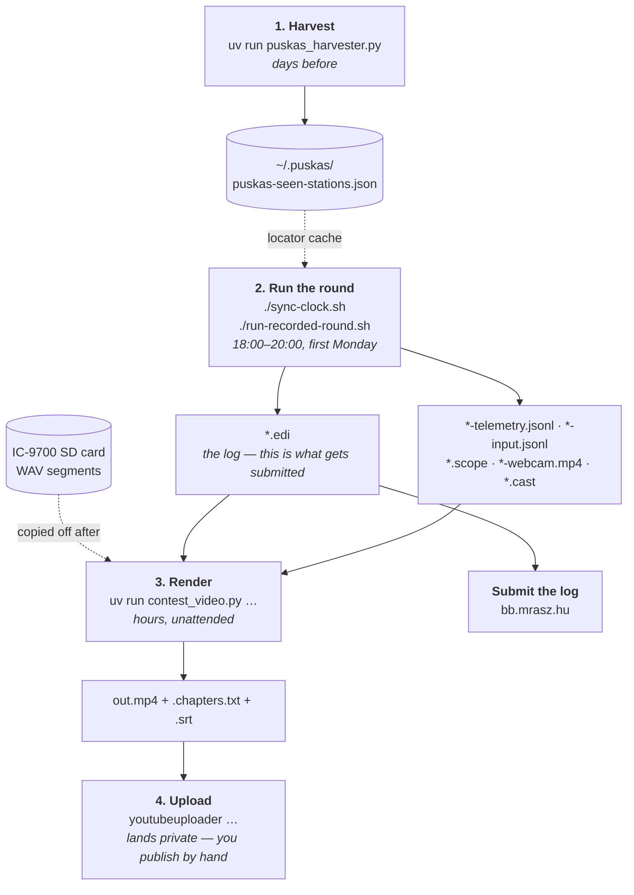

# The pipeline, end to end

One round, from before it starts to a published video. Everything here
is the *story*; ARCHITECTURE.md has the components, RECORDING.md the practical
detail of recording and rendering.



## 1. Before the round — harvest

```
uv run puskas_harvester.py
```
Builds `~/.puskas/puskas-seen-stations.json` from every claimed Puskás round on
`bb.mrasz.hu`. The logger merges it into a locator cache at startup, so during
the round a callsign completes to a locator, a distance and a bearing with **no
network access at all**. Run it once, days ahead; it caches API responses in
`.puskas_cache/`.

## 2. The round itself

```
./sync-clock.sh                     # chrony resync, right before
./run-recorded-round.sh             # right before — nothing earlier
```

The second script is the entrypoint, and starting/stopping that one tmux session
is what starts and stops everything:

- **Window 0, recorded by asciinema**: irssi | `puskas_logger.py`, side by side.
  This layout is what `contest_video.py --cast` expects.
- **Window 1 (`bg`, not recorded)**: `hamlib_supervisor.py` and
  `on4kst_irc_bridge.py`. They live here rather than in a `systemd --user` unit
  precisely because they should run for the round and not a minute longer —
  killing the tmux session tears them down with everything else. Attach to it to
  watch the bridge's connect/drop messages.

Separately and by hand: the **IC-9700's own Voice Recorder** is switched on, and
it records to its SD card, splitting a new WAV on every RX/TX transition. Then
**Alt+S** in the logger, to confirm it — the radio cannot be asked whether it is
recording, so until you say so the toolbar carries a red `SD ✗`.

While the round runs, the logger is writing five things besides the log: rig and
rotator telemetry, every keystroke and QSO, the radio's sweeps, and —
if Alt+V was pressed — a webcam capture. None of it is recoverable afterwards,
which is why it is all on by default.

**What must be true before you start**: `~/.netrc` has the ON4KST and radio
credentials, the radio's Network Control is on, and the radio's NTP points at
the laptop (see RECORDING.md — the laptop serves it time). The toolbar states
the rest of it: nothing red, nothing yellow, and the `CLK` chip near zero.

## 3. After the round — render

Copy the WAV segments off the radio's SD card into `recording/` next to the log,
then:

```
uv run contest_video.py recording *.edi \
  --telemetry *-telemetry.jsonl --input-log *-input.jsonl \
  --cast *.cast --scope *.scope -o out.mp4 \
  --webcam CALL-webcam-<stamp>.mp4     # repeat the flag per Alt+V capture
```

This is the long, unattended step — roughly 1.5× the round's own length at
720p with everything on. Preview first: `--duration 1200 --res 720p` cuts it to
minutes, and `--hud-demo` checks the status bar's layout in about a second.

Out come `out.mp4`, `out.mp4.chapters.txt` and `out.mp4.srt`.

## 4. Publish

**The log goes to `bb.mrasz.hu`** — the `.edi` files, one per band. That is the
part that actually counts for the contest; everything else here is storytelling.

**The video goes to YouTube** via `youtubeuploader`, as a deliberate manual step
after reviewing the render. It lands *private*; flipping it to public is a human
decision made in YouTube Studio, and nothing in this repo auto-publishes.

### Uploading a rendered video to YouTube
`contest_video.py` only renders the mp4 + `.chapters.txt` + `.srt` — it does not upload.
Uploading is a deliberate separate manual step, run after reviewing the render, using
[`youtubeuploader`](https://github.com/porjo/youtubeuploader) (a Go binary, installed at
`~/.local/bin/youtubeuploader`):

```
youtubeuploader \
  -filename out.mp4 \
  -title "Puskás URH Kupa 2026-07 — HA5LA" \
  -description "$(cat out.mp4.chapters.txt)" \
  -caption out.mp4.srt \
  -secrets ~/.config/youtubeuploader/client_secrets.json \
  -cache ~/.config/youtubeuploader/request.token
```
- **OAuth credentials are intentionally global, not project-specific** —
  `~/.config/youtubeuploader/` holds one client secret + cached token shared across every
  project on this machine that uploads to this YouTube channel, not just `urhpk`.
- Video lands **private** by default (both the flag default and Google's own forced-private
  restriction on new/unverified API projects) — this is the review gate: check it on YouTube,
  then flip to Public/Unlisted by hand in YouTube Studio. Nothing in this repo auto-publishes.
- The OAuth consent screen is left in "Testing" mode (no Google verification review needed
  for personal single-channel use) — the tradeoff is the refresh token expires after 7 days,
  requiring a re-click through the browser consent screen. Irrelevant in practice since
  rounds are monthly.

### Why the logger's pane is recorded with asciinema

`run-recorded-round.sh` records the logger's pane with
[asciinema](https://asciinema.org/) — not the irssi pane, and not a
screen-capture tool like `recordmydesktop`. The console UI is plain text, so a graphical
screen recording would just be lossy video of something that's already
exactly representable as text; `asciinema`'s cast v2 format is a timestamped
stream of terminal output plus a header carrying the exact real-world UTC
start time (see `parse_cast_header`), which is exactly what
`render_cast_video` needs to replay it losslessly and sync it into the
video's timeline. Plain `script(1)` capture was considered and rejected for
the same reason recordmydesktop was: no per-event timestamps, so it can't be
replayed frame-accurately or synced to the audio at all.
